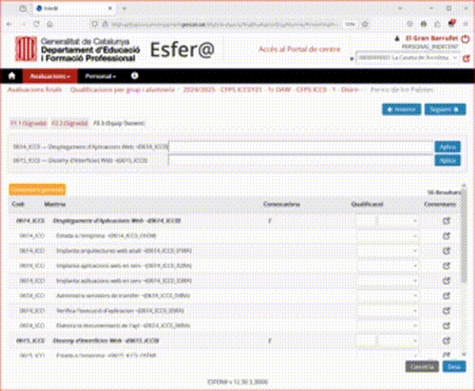

# Esfer@ PowerToys

Millora accessibilitat per a la plataforma Esfer@ d'avaluació del Departament d'Educació de la Generalitat de Catalunya.

Aquest script permet aplicar ràpidament notes fent copy-paste des del teu full de càlcul.


#a11y #UI

---

## 🔧 Requisits

Per instal·lar aquest script necessites:

- 🔌 [Tampermonkey](https://www.tampermonkey.net/) — una extensió per a navegadors que permet executar scripts d'usuari.
- 🌐 Un navegador compatible (Chrome, Firefox, Edge...).

---

## 🚀 Instal·lació

1. Instal·la **Tampermonkey** des de la seva web oficial, selecciona el teu navegador i ves a l'apartat `Download`:  
   👉 [https://www.tampermonkey.net/](https://www.tampermonkey.net/)

2. Fes clic aquí per instal·lar l'Esfer@a PowerToys:  
   👉 [`Esfer@ PowerToys`](https://raw.githubusercontent.com/ctrl-alt-d/EsferaPowerToys/refs/heads/main/dist/script.user.js)

   Tampermonkey t'obrirà una pestanya amb el codi i un botó per **"Install"**.

3. Un cop instal·lat, quan entris a qualificacions finals per grup i alumne/a et permetrà fer copy-paste de les notes des d'un full de càlcul.

   L'script s'activarà automàticament.

---

## Funcionalitats actuals

- ✅ Aplicació massiva de notes qualitatives a cada matèria.
- ✅ Traducció automàtica de notes numèriques a valors com `A10`, `A7`, `PDT`, etc.
- ✅ Scroll automàtic a l'assignatura per veure els canvis.
- ✅ Interfície afegida al principi de la pàgina amb inputs i botons útils.
- ✅ Botó per a ficar a pendent totes les RAs d'un Mòdul que no tenen nota (això inclou la nota d'estada aen empresa i la nota del mòdul)

---



🎨 El gif animat cortesia d' [@ermengolbota](https://github.com/ermengolbota).


---

## Contribucions

Estàs convidat/da a col·laborar!

- Tens idees de millores?
- Has trobat algun error?
- Vols afegir suport a altres parts de l’Esfer@?

Fes un fork del repositori, obre una pull request, o obre una issue. Totes les contribucions són benvingudes!

📌 Repositori:  
[https://github.com/ctrl-alt-d/EsferaPowerToys](https://github.com/ctrl-alt-d/EsferaPowerToys)

---

## Llicència MIT — Sense responsabilitats

Aquest projecte està distribuït sota la llicència [MIT](./LICENSE).

**Això vol dir:**

- Pots utilitzar, modificar i redistribuir lliurement el codi.
- El codi s'ofereix **tal com és**, **sense garanties de cap mena**.
- L’autor **no es fa responsable** de cap dany, error o conseqüència derivada del seu ús.

Fes-lo servir sota la teva responsabilitat i sentit comú.

---

## 📝 ToDo

- 🧹 Afegir tests per a cada classe.

---


## 👩‍💻 Ets Developer i vols trastejar?

### Requisits previs

- **Node.js ≥ 22** (recomanat: última LTS). Descarrega'l des de [nodejs.org](https://nodejs.org/).
- **pnpm** — gestor de paquets. Instal·la'l amb una d'aquestes opcions:

  | Plataforma | Comanda |
  |---|---|
  | macOS / Linux | `corepack enable` (ja inclòs amb Node) |
  | Windows | `corepack enable` (executa com a Administrador) |
  | Alternativa universal | `npm install -g pnpm` |

  > El camp `packageManager` del `package.json` ja fixa la versió de pnpm. Si fas servir Corepack, s'activarà automàticament la versió correcta.

### Compilar i testejar

```bash
# 1. Clona el repositori
git clone https://github.com/ctrl-alt-d/EsferaPowerToys.git
cd EsferaPowerToys

# 2. Instal·la les dependències
pnpm install

# 3. Compila l'script (genera dist/script.user.js)
pnpm run build

# 4. Executa els tests
pnpm test
```

### Incrementar la versió

Modifica el fitxer `build/version.js` i torna a compilar.

## Notes

Esfer@ PowerToys treballa modificant la UI, veient com està fet l'Esfer@, em plantejo bypassar la UI i usar directament les APIs no documentades d'Esfer@.